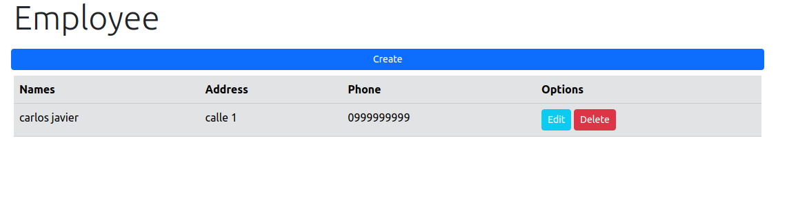

# Node Express Project WebEmployee

Computer Version:

[](https://www.microsoft.com/es-es/windows/windows-11?r=1)
[](https://ubuntu.com/)
[](https://www.apple.com/la/mac/)

> <strong> Project to register the data of an employee, we use node - express - mysql. </strong>



[](https://expressjs.com/es/)
[](https://www.javascript.com/)
[](https://www.npmjs.com/)
[](https://nodejs.org/es/)
[](https://www.mysql.com/)
[](https://github.com/)
[](https://git-scm.com/)
[](https://www.linux.org/)
[](https://www.microsoft.com/es-es/windows/windows-11?r=1)
[](https://code.visualstudio.com/)

## 💻 Pre requirements


To use the project on your machine, you must have the following installed:

- Have the mysql service installed or a local server that has the service.
- Have installed nodejs higher than v14 and MySQL higher than 5.7.

## 🌐 Database <node_webemployee>


Before starting the project <node_webemployee>, you must follow these steps:

1. Copy the script from the database to your local mysql engine.
   > db/employee.js
2. Create an .env at the root of the project.
3. In the .env file add the execution port of the project and the MYSQL credentials:
   ```
   PORT=9000
   DB_HOST=localhost
   DB_PORT=3306
   DB_SCHEMA=name_db
   DB_USER=root
   DB_PASSWORD=root
   ```

## ☕ Requirements <node_webemployee>


To start the project <node_webemployee>, you must follow the following steps:

1. Open a terminal at the root of the project.
2. In the main root of the project execute the following in your terminal:
   ```
   npm install
   ```

## 🚀 Start project <node_webemployee>

To start the project <node_webemployee>, you must follow the following steps:

- Open a terminal at the root of the project.
- Run the following command:
  ```
  npm run test
  ```
- Open the following path in your preferred browser:
  - 🌐 [http:/127.0.0.1:9000/](http://127.0.0.1:9000/)

<div align="center">

### My social accounts


[](https://twitter.com/harlericho)
[](https://github.com/harlericho)
[](https://hub.docker.com/u/harlericho)
[](https://harlericho.netlify.app)

</div>

<p align="center"><strong>Copyright © 2022 Harlericho</strong></p>
